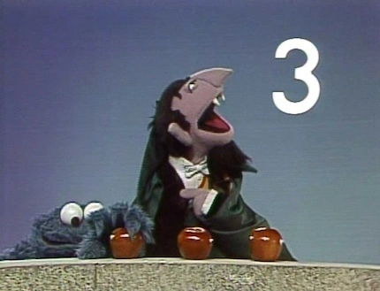

+++
title = 'Counting Doughnuts'
date = '2025-11-15T18:58:53-06:00'
tags = ['maths', 'combinatorics', 'doughnuts']
summary = """\
There are 1,529,143,625,215,220 ways to order a dozen doughnuts at a
Dunkin' Doughnuts.
"""
[params]
  mathjax = true
+++

Snooping around the [Dunkin' doughnuts website][dunkin], I wanted to
know how many different kinds of doughnuts they offer. I want to
figure out how many total ways are there to order a dozen. Why?
_Because!_ A little bit of HTML sifting et voilà! Actually, sorry, it
is not here, but I'll put it at the end of the article. The list at
the end of the article enumerates the 92 different kinds of
"doughnuts." In a characteristically mathematical fashion, let's start
with the definitions.  When I say, _total ways to order a dozen_, I
mean:

- A dozen: 12.
- Total ways: The total number of unique orders of a dozen doughnuts
  that could be placed at a Dunkin' Doughnuts.

This leaves us with the definition of a _unique_ order for a dozen
doughnuts.

- Do we consider the same doughnuts but arranged differently two
  separate (unique) orders?
- Do we allow more than one doughnut of a kind, i.e., repetition?

## Arrangement Doesn't Matter and No Repetitions

This is a simple case of 92 choose 12 combinations.
\[
\binom{92}{12} = \frac{92!}{12!(92-12)!} = 362827605867363
\]

## Arrangement Doesn't Matter and Yes Repetitions

This is the [stars and bars][wikipedia] problem.  We simply want to
know the number of integer solutions to the following equation.
\[
x_1 + x_2 + x_3 + \cdots + x_{92} = 12
\]
Here each \(x_i\) corresponds to the number of doughnuts we order of
the \(i^\text{th}\) type.
\[
\binom{12+92-1}{12} = \frac{103!}{12!(103-12)!} = 1529143625215220
\]

## Arrangement Matters and No Repetitions

These are simple permutations without replacement.
\[
P(92, 12) = \frac{92!}{(92-12)!} = 173795003734636264780800
\]

## Arrangement Matters and Yes Repetitions
These are simple permutations with replacement.
\[
92^{12} = 367666387654882241806336
\]

## The Right Interpretation

I think the natural interpretation of the number of ways to order a
dozen doughnuts is where arrangement does not matter and repetition is
allowed. That is, because we don't really care how the baker arranges
the doughnuts in the box, and we might want two of the say,
blueberry. Therefore, the number of ways to order 12 doughnuts at the
Dunkin' Doughnuts is 1,529,143,625,215,220. For reference, this is
more than the number of estimated stars in the Milky Way galaxy.

## Choices of Doughnuts at a Dunkin' Doughnuts

1. Strawberry Iced Holiday Sprinkle Takeover  
2. Chocolate Iced Holiday Sprinkle Takeover  
3. Vanilla Iced Holiday Sprinkle Takeover  
4. Poe's Purple Donut  
5. Raven's Flock Donut  
6. Redland Donut  
7. Buttermilk Donut  
8. Go Hornets Donut  
9. Bulls Donut  
10. ALLCAPS Donut  
11. Jaguars Hall of Fame Donut  
12. TN Titans Donut  
13. Padres Donut  
14. Dodgers Donut  
15. The GOAT Donut  
16. Birdland Donut  
17. Orioles Magic Donut  
18. Reds Donut  
19. Fenway Faithful Donut  
20. Cleveland Guardians Donut  
21. Pittsburgh Penguins Donut  
22. Inter Miami Donut  
23. Apple Crumb Donut  
24. Apple Fritter  
25. Apple 'n Spice Donut  
26. Apple Stick  
27. Apple Streusel Donut  
28. Bavarian Kreme Donut  
29. Bismark  
30. Boston Kreme Donut  
31. Butternut Donut  
32. Chocolate Butternut Donut  
33. Chocolate Coconut Donut  
34. Chocolate Creme Donut  
35. Chocolate Crème Stick  
36. Chocolate Dipped French Cruller  
37. Chocolate Frosted Cake Donut  
38. Chocolate Frosted Donut  
39. Chocolate Frosted with Chocolate Sprinkles Donut  
40. Chocolate Frosted with Sprinkles Donut  
41. Chocolate Headlight Donut  
42. Chocolate Long John  
43. Cinnamon Donut  
44. Cinnamon Stick  
45. Coconut Donut  
46. Coffee Roll  
47. Creme Delight Donut  
48. Double Chocolate Donut  
49. Eclair  
50. French Apple Donut  
51. French Cruller  
52. Frosted Vanilla Creme Donut  
53. Glazed Blueberry Donut  
54. Glazed Chocolate Donut  
55. Glazed Chocolate Stick  
56. Glazed Donut  
57. Glazed Jelly Donut  
58. Glazed Jelly Stick  
59. Glazed Lemon Donut  
60. Glazed Stick  
61. Glazed Strawberry Donut  
62. Guava Donut  
63. Indy Creme Donut  
64. Jelly Donut  
65. Jelly Stick  
66. Lemon Donut  
67. Lemon Stick  
68. Maple Crème Donut  
69. Maple Creme Stick  
70. Maple Frosted Donut  
71. Maple Long John Donut  
72. Maple Vanilla Crème Donut  
73. Marble Frosted Donut  
74. New Yorker Donut  
75. Old Fashioned Donut  
76. Peanut Donut  
77. Pittsburgh Crème Donut  
78. Plain Stick  
79. Powdered Donut  
80. Powdered Stick  
81. Sour Cream Donut  
82. Strawberry Frosted Donut  
83. Strawberry Frosted Sprinkles Donut  
84. Sugared Donut  
85. Sugared Stick  
86. Taillight Donut  
87. Toasted Coconut Donut  
88. Vanilla Crème Donut  
89. Vanilla Frosted Donut  
90. Vanilla Frosted Sprinkles Donut  
91. Vanilla Headlight Donut  
92. Vanilla Long John  

[dunkin]: https://www.dunkindonuts.com/en/menu/donuts/product-donuts-id1001201
[wikipedia]: https://en.wikipedia.org/wiki/Stars_and_bars_(combinatorics)
