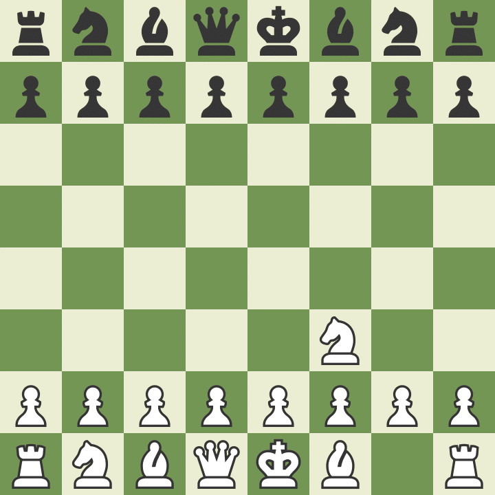

+++
title = 'Queen Sacrifice'
date = '2025-12-23T23:15:57-06:00'
tags = ['Chess', 'Queen Sacrifice']
+++

There are sound chess moves and then there is impulse-queen-sacrifice
gambit.



Head over to [chess.com][share] to snoop more. Or, if you are more
chess literate than I am, here is the algebraic notation.

```
1. Nf3 d5 2. c4 dxc4 3. e3 Nc6 4. Bxc4 e5 5. h4 Bg4 6. b3 $2 e4 $1 7. Ng5 Bxd1 8.
Nxf7 $6 Qf6 9. Nc3 Nd4 $6 10. exd4 e3 11. Kxd1 Qxf2 $4 12. Nxh8 $6 Bb4 $3 13. Rf1
Qg3 $2 14. Bb2 $9 Qg4+ $9 15. Rf3 $9 Qxd4 $9 16. Rxe3+ $1 Qxe3 $6 17. dxe3 O-O-O+
18. Nd5 Bc5 19. e4 Nf6 20. Nf7 Nxe4 21. Nxd8 Kxd8 22. Bxg7 Nf2+ 23. Ke2 1-0
```

[share]: https://www.chess.com/game/live/147104467310
