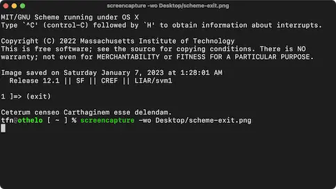

+++
title = 'Carthago delenda est'
date = '2025-10-26T01:08:44-05:00'
tags = ['Humour', 'Programming']
+++

I have recently and finally got my hands on a copy of the famous
computer programming textbook, dubbed _the wizard manual_: [Structure
and Interpretation of Computer Programs][sicp], often abbreviated as
SICP. The textbook uses MIT-Scheme (a dialect of Lisp) to express
their programs. I found this guide titled [Don't Panic][panic] quite
helpful as it seems to be the updated version of the one found at the
[MIT Open Courseware][ocw] website for the relevant course. It in-turn
pointed me to the [MIT/GNU Scheme][scheme] page where you can get the
Scheme that the textbook uses. There is also a [Homebrew
formula][brew].

Anyway, I downloaded the MIT/GNU Scheme and gave it a spin, exiting
with `(exit)`.

Did it just cast a hex? I looked up _Ceterum censeo Carthaginem esse
delendam._ Apparently, it means _Furthermore, I think that Carthage
must be destroyed._ From [Wikipedia][cato],

> [It] is a Latin oratorical phrase attributed to Cato the Elder, a
> politician of the Roman Republic. The phrase originates from debates
> held in the Roman Senate prior to the Third Punic War (149–146 BC)
> between Rome and Carthage. Cato is said to have used the phrase as
> the conclusion to all of his speeches to push for the war, even when
> the speech was otherwise unrelated to Carthage or foreign affairs.

Ahh, politicians: _plus ça change, plus c’est la même chose._ Thank you for your
attention to this matter! ;-)

[sicp]: https://en.wikipedia.org/wiki/Structure_and_Interpretation_of_Computer_Programs
[panic]: https://groups.csail.mit.edu/mac/users/gjs/6.945/dont-panic/#orgb8452c3
[ocw]: https://ocw.mit.edu/courses/6-001-structure-and-interpretation-of-computer-programs-spring-2005/pages/tools/tools/
[scheme]: https://www.gnu.org/software/mit-scheme/
[brew]: https://formulae.brew.sh/formula/mit-scheme#default
[cato]: https://en.wikipedia.org/wiki/Carthago_delenda_est
